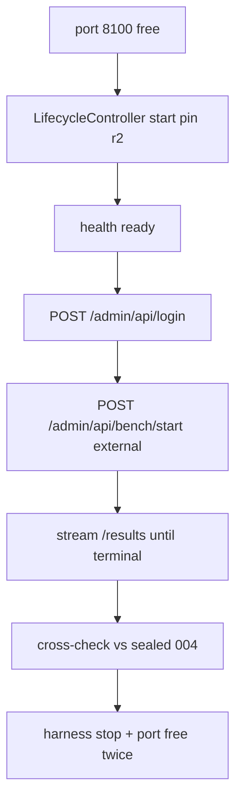

# Package 2 D3 — oMLX External-Bench Parity Design

**Status:** Design accepted (Jason, 2026-07-22). Fake-only / docs first.
Does **not** authorize live POSTs, new run IDs, admin login against a live
server, accuracy-bench, omlx.ai upload, OptiQ/Stage 2 retarget, or plugin
rebuild.

**Depends on:** Sealed D4 live PASS
`omlx-thinking-measure-20260722-004` (pin r2 + measure suite r2 +
`QUALIFIED_REASONING_CONTENT_SPLIT`). That cohort remains sealed evidence; D3
does not reopen it.

**Order:** After D4 (Jason, 2026-07-22).

## Goal

One harness-owned Package 2 parity cohort that:

1. Starts dedicated oMLX on `:8100` (Slice 1a / pin r2).
2. Runs oMLX admin **throughput** bench in **external** mode against the owned
   loopback OpenAI API (`http://127.0.0.1:8100/v1`) with the pinned thinking
   model and matrix-local auth.
3. Records TTFT / throughput-ish metrics from the bench.
4. Writes a sealed cross-check note vs harness
   `omlx-thinking-measure-20260722-004`.

## Locked product decisions

| Decision | Choice |
|---|---|
| Intent | Parity / metric cross-check (not strict label parity) |
| Ownership | Harness-owned dedicated serve (`service_lifecycle_actions > 0`) |
| Bench path | Admin throughput bench **external** mode → owned loopback |
| Not chosen | Local in-process engine bench; accuracy-bench queue; operator-owned serve |

## Non-goals

- Replacing harness chat measure as the Stage engine  
- Requiring harness `QUALIFIED_*` / suppression label equality  
- Accuracy-bench  
- OptiQ / Stage 2 lanes  
- Plugin `0.3.0` rebuild  
- Uploading results to omlx.ai  
- Reclaiming a foreign `:8100` pool without separate approval  

## Lifecycle + admin API contract

**Pin:** Reuse `omlx-0.5.3-thinking` revision `2` + Slice 1a
`LifecycleController` (dedicated `:8100`, force-free cleanup). Port must be
free before start.

**After ready:**

1. **Admin session:** `POST http://127.0.0.1:8100/admin/api/login` with the
   matrix-local API key → session cookie. Admin routes are cookie-gated unless
   skip-auth is enabled.
2. **Start bench:** `POST /admin/api/bench/start` with:
   - `model_id`: pinned model id
   - `prompt_lengths`: `[1024]` only (smallest valid oMLX length; bounded
     cohort, not a leaderboard sweep)
   - `generation_length`: `4096` (thinking-safe; matches oMLX external
     preflight floor)
   - `batch_sizes`: `[]` (single-request only)
   - `external`:
     - `base_url`: pin `base_url` (`http://127.0.0.1:8100/v1`)
     - `api_key`: matrix-local
     - `model`: pin `model_id`
     - `extra_body`: `{ "chat_template_kwargs": { "enable_thinking": true } }`
3. **Consume** `GET /admin/api/bench/{bench_id}/stream` (and/or `/results`)
   until terminal; then harness stop/cleanup.

**Fail-closed:** login `401`/`400`, bench `409` (already running), stream
error, or cleanup port-busy → `FAIL` / `FAIL_CLEANUP`. Do not upload to
omlx.ai.

**Auth risk (named):** dedicated pin `start_command` has no `--api-key`; admin
login depends on the server’s configured key matching matrix-local (or
skip-auth). Gate A fakes the client; Gate B proves live login before
authorizing a run ID.

## Evidence + cross-check

**Comparison class:** `omlx-thinking-external-bench-parity-v1` (do not mix into
sealed measure `004` evidence).

**Record from bench results (per test):** `ttft_ms`, `tpot_ms`, `gen_tps`,
`e2e_latency_s`, `prompt_tokens`, `completion_tokens`, plus run `status` /
error. Persist JSON + short MD under `docs/superpowers/verification/`.

**Cross-check note (required)** vs sealed `004` must call out at least:

1. **TTFT semantics diverge** — oMLX external client times first `content`
   *or* `reasoning_content`; harness D4 TTFT is **content-only**. Expect
   systematic skew; do not claim equality.
2. Throughput / completion totals vs harness completion-token-class fields
   where present (informational).
3. Viability: external preflight OK + single `1024` test completes without
   false thinking failure.

**Decision codes:** `PASS` / `FAIL` / `FAIL_CLEANUP` (Package 2 live shape).
`PASS` = bench completed + cleanup OK + cross-check note written. **Not**
“metrics match `004`.”

## Gates

| Gate | Scope |
|---|---|
| **A** | Fake-only client (login + start + stream parse), runner wiring, docs; no live POSTs / run IDs |
| **B** | Readiness: pin r2, port free, **live admin login proof** (or documented skip-auth); no bench start yet |
| **C+** | Jason authorizes one unused ID (e.g. `omlx-thinking-bench-20260722-001`); live cohort + seal |

**Rollback:** Package 2 harness measure / D4 unchanged. Plugin `0.3.0`
untouched.

## Code surface (Gate A)

| Area | Change |
|---|---|
| Client | Admin login + bench start/stream/results against loopback (fakes in tests) |
| Runner | Lifecycle + parity orchestration; honest lifecycle action counts |
| Comparison | New class / suite or pinned request constants for the single `1024` cohort |
| Evidence helpers | Cross-check note template fields |
| Docs | This design; Gate D / D3 follow-on row → Gate A ready when implemented |

Pin JSON r2 unchanged unless Gate B proves `--api-key` must be added via a
**new pin revision** (separately decided; do not silently rewrite r2).

## Success criteria (Gate A)

- Fake tests prove external-mode request body, stream parse, and fail-closed
  auth errors.
- Design/docs committed.
- No live authority created.

## Follow-on after Gate A

- Gate B readiness + live admin login proof.
- Jason authorizes one unused bench run ID.
- Live cohort + sealed cross-check vs `004`.

## Related

- Sealed D4 PASS: `docs/superpowers/verification/2026-07-22-package-2-d4-omlx-thinking-measure-20260722-004.md`
- D4 design: `docs/superpowers/specs/2026-07-22-package-2-d4-reasoning-content-decode-design.md`
- Package 2 measure design: `docs/superpowers/specs/2026-07-22-package-2-omlx-thinking-measure-design.md`
- Gate D follow-ons: `docs/package-2-omlx-thinking-gate-d.md`
- oMLX admin: `/admin/api/bench/start`, `ExternalEndpointConfig` in
  `omlx/admin/external_api.py` (installed app; not vendored here)
