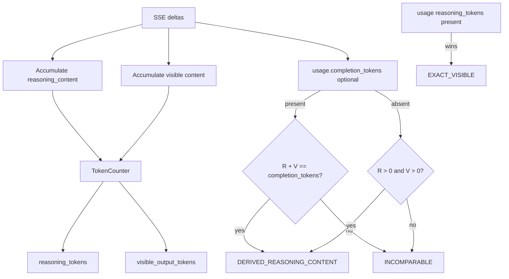

# Package 2 D4 — Reasoning-Content Decode Accounting Design

**Status:** Design accepted (Jason, 2026-07-22). Fake-only / docs first.
Does **not** authorize live POSTs, new run IDs, Responses API retarget, or D3
external-bench.

**Depends on:** Sealed request-pin live PASS
`omlx-thinking-measure-20260722-003` (pin r2 + measure suite r2). Decode on that
cohort remains `SUPPRESSED_AMBIGUOUS_TOKEN_ACCOUNTING` — residual closed as PASS
evidence, not a reopen.

**Order:** D4 before D3 (Jason, 2026-07-22).

## Goal

On the existing harness **chat** path, derive a reasoning / visible token split
from streamed `delta.reasoning_content` so thinking-measure decode can leave
`SUPPRESSED_AMBIGUOUS_TOKEN_ACCOUNTING` **without** claiming server-reported
`EXACT_VISIBLE` usage.

## Investigation lock (option 3 rejected)

Retargeting to `/v1/responses` was considered and rejected for D4:

- Chat live evidence (`001` / `003`) shows no
  `completion_tokens_details.reasoning_tokens` on chat usage.
- Responses exposes `usage.output_tokens_details.reasoning_tokens`, but on
  installed oMLX `0.5.3` that value is `len(tokenizer.encode(reasoning_text))`
  after extracting thinking text — the same derivation class as chat
  `reasoning_content`, not generation-engine usage.
- Upstream PR [#1245](https://github.com/jundot/omlx/pull/1245) wired those
  counts by tokenizing extracted thinking (after an earlier streaming hardcode
  of `0`).
- Release notes for `0.5.2` / `0.5.3` do not promise chat usage reasoning
  details.

**Locked product decision:** stay on harness chat; derive from
`reasoning_content`; use an honest derived decode label.

## Locked decisions

1. **Lane:** Package 2 thinking-measure chat path only (pin r2, measure suite r2).
2. **Status vocabulary:**
   - `EXACT_VISIBLE` — only when usage provides
     `completion_tokens_details.reasoning_tokens` (unchanged precedence).
   - `DERIVED_REASONING_CONTENT` — new; stream-derived split.
   - `INCOMPARABLE_TOKEN_ACCOUNTING` — neither usable path.
3. **Decode labels:**
   - `QUALIFIED_EXACT_VISIBLE_TOKENS` — unchanged exact path.
   - `QUALIFIED_REASONING_CONTENT_SPLIT` — new; cohort qualifies on derived path.
   - Existing suppressions unchanged (`SUPPRESSED_*`).
4. **TTFT:** First **content** delta timing only (not reasoning deltas).
5. **TokenCounter:** Injectable protocol; live default loads tokenizer for pinned
   `model_dir`; tests inject fakes. No live network in Gate A tests.
6. **Live:** Separately gated; new unused run ID required (do not reuse `001`–
   `003`).

## Derived-path rules

- Accumulate `reasoning_text` from `delta.reasoning_content` in the same SSE loop
  as content.
- Visible text remains content-only.
- Tokenize both strings via `TokenCounter`.
- If usage `completion_tokens` is present, require
  `reasoning_tokens + visible_output_tokens == completion_tokens`; mismatch →
  `INCOMPARABLE_TOKEN_ACCOUNTING`.
- If usage omits completion totals, allow `DERIVED_REASONING_CONTENT` when both
  counts are `> 0`.
- If usage provides `completion_tokens_details.reasoning_tokens`, that path wins
  (`EXACT_VISIBLE`) and derived counts are not required.

## Qualification (`qualify_thinking_metrics`)

For `outcome == "ok"` samples with incremental streaming:

- All `EXACT_VISIBLE` with positive visible tokens and positive content span →
  decode `QUALIFIED_EXACT_VISIBLE_TOKENS`.
- Else all `DERIVED_REASONING_CONTENT` with positive visible tokens and positive
  content span → decode `QUALIFIED_REASONING_CONTENT_SPLIT`.
- Mixed exact/derived in one cohort → suppress decode
  (`SUPPRESSED_AMBIGUOUS_TOKEN_ACCOUNTING`) fail-closed.
- TTFT remains `QUALIFIED_INCREMENTAL_DELIVERY` when incremental and not
  token-capped / empty (unchanged).

## Code surface (Gate A)

| Area | Change |
|---|---|
| `transport.py` | Capture `reasoning_content` deltas; optional TokenCounter hook; status/counts |
| `omlx_thinking_measure.py` | Decode label for derived status |
| `omlx_thinking_transport.py` / runner | Plumb fields already present; verify end-to-end |
| Tests | Fake SSE with reasoning deltas; exact path still wins; mismatch → incomparable |
| Docs | This design; Gate D / D2 follow-on rows → D4 Gate A ready |

Pin JSON and measure suite r2 unchanged.

## Non-goals

- `/v1/responses` retarget  
- D3 external-bench  
- Claiming derived counts as `EXACT_VISIBLE`  
- Editing sealed `001`–`003` evidence  
- Plugin rebuild  

## Success criteria (Gate A)

- Fake tests prove derived status + new decode label without live oMLX.
- Exact usage path unchanged and preferred when present.
- Completion-total mismatch fails closed to incomparable.
- No live authority created.

## Follow-on after Gate A

- Gate B readiness (existing CLI; pin r2).
- Jason authorizes one unused measure ID (e.g. `omlx-thinking-measure-20260722-004`).
- Live cohort expects decode `QUALIFIED_REASONING_CONTENT_SPLIT` when thinking
  streams reasoning content (TTFT may remain qualified incremental).

## Related

- Sealed PASS `003`: `docs/superpowers/verification/2026-07-22-package-2-request-pin-omlx-thinking-measure-20260722-003.md`
- Request-pin design: `docs/superpowers/specs/2026-07-22-package-2-thinking-request-pin-design.md`
- Gate D follow-ons: `docs/package-2-omlx-thinking-gate-d.md`
