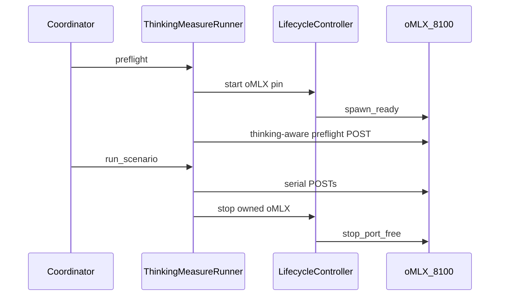

# Package 2 — oMLX 0.5.2 Thinking-Model Measurement Design

**Status:** Gate A landed (planning + fake-only implementation). Expands the Package 2 stub in
`docs/superpowers/specs/2026-07-21-stack-review-gate-a-queue-design.md`.
Does **not** authorize Gate B, live runs, oMLX upgrades on disk, Stage 2 OptiQ
retarget, plugin rebuild, or a same-artifact OptiQ↔oMLX matrix campaign.

**Depends on:** Slice 1a (`harness_lifecycle` oMLX `:8100` start/stop) — landed.
Package 1 (1b/1c) is **not** a hard dependency; OptiQ pin-confirm may proceed in
parallel.

## Goal

Make thinking-model measurement on oMLX **viable without false preflight
failure**, using oMLX `0.5.2`’s external-bench / token-budget fixes as the
upstream unlock, while the harness owns a fail-closed measurement contract of
its own (lifecycle + preflight + qualification).

## Problem statement

Before `0.5.2`, thinking models could fail oMLX external-bench preflight because
the preflight token budget was too small for reasoning tokens. The harness also
needs its own rules so a thinking completion is not treated as transport failure
or “wrong answer,” and so TTFT/decode qualifications stay honest when reasoning
tokens dominate.

## Locked product decisions

1. **Lane:** New **oMLX thinking-measure** lane — not Stage 2 OptiQ schemas
   `3.3.0`/`3.4.0`/`3.5.0`.
2. **Lifecycle:** Use Slice 1a `LifecycleController` for oMLX `:8100` (owned
   spawn/stop, 20% RAM floor, reclaim via `omlX stop` when busy). Never kill
   foreign Osaurus.
3. **Measurement surface (Gate A default):** Harness OpenAI-compatible chat
   completions against loopback oMLX (`http://127.0.0.1:8100/v1`), with thinking
   enabled via model/extra-body contract pinned in a profile — **not** adopting
   oMLX’s external-bench runner as the Stage engine in Gate A.
4. **External-bench:** Document as a **later optional path** once harness
   measurement qualifies; do not bind Gate A success to wrapping oMLX CLI bench.
5. **Evidence:** Separate comparison class / suite from sealed OptiQ `005`/`006`.
6. **Pin:** Target oMLX **`0.5.2`** (exact path/version/hash in a new runtime or
   matrix-style pin). Disk upgrade remains pin-confirm / Gate B gated.

## Proposed Gate A contract names

| Field | Value |
|---|---|
| Schema (if Stage-shaped) **or** module suite | Prefer a **standalone suite + runner** under matrix/preference patterns first; only introduce a Stage schema if factory reuse is clearly smaller |
| Comparison class | `omlx-thinking-measure-v1` |
| Suite | `omlx-thinking-smoke-v1` revision `1` (small: ≤8 serial requests) |
| Server | oMLX `:8100` only |
| Profile / pin id | `omlx-0.5.2-thinking` revision `1` (provisional until pin-confirm) |

Exact schema number is deferred to the implementation plan if a Stage schema is
chosen; default recommendation is **non-Stage suite runner** to avoid coupling
to OptiQ Stage 2 policy.

## Fail-closed measurement rules (Gate A)

- Preflight probe must use a **thinking-aware token budget** (configurable floor;
  default high enough for reasoning + short visible answer). Too-small budget is
  a config error, not a model failure.
- Distinguish: transport/endpoint failure vs empty visible answer vs wrong-answer
  contract vs token-cap (`finish_reason=length`).
- Record `reasoning_tokens` when the API provides them; qualification labels for
  TTFT/decode must suppress or annotate when accounting is ambiguous (reuse
  Stage 2B smoke qualification vocabulary where applicable).
- Thinking toggles / extra body params are **pinned** in the profile (provider
  extras allowed only from that allowlist).

## Harness lifecycle integration

`service_lifecycle_actions` (or runner equivalent) must be honest (>0 when
harness starts/stops oMLX).

## Non-goals

- Stage 2 OptiQ retarget or mixing OptiQ sealed evidence  
- Same-artifact OptiQ↔oMLX matrix campaign  
- Preference/RAG expansion  
- Live Gate B / run IDs / disk oMLX upgrade from this design  
- Plugin `0.3.0` rebuild  
- Claiming pre-`0.5.2` oMLX throughput numbers as comparable

## Success criteria (design)

- Gate A plan can implement fake-only tests for: oMLX lifecycle via 1a, thinking
  preflight budget, failure-class distinction, qualification of reasoning-heavy
  samples.
- Pin-confirm checklist exists for oMLX `0.5.2` install + model identity.
- No live authority created.

## Related notes

- Vault / repo: `docs/superpowers/notes/2026-07-21-omlx-0.5.2-implications.md`
- Queue: `docs/superpowers/specs/2026-07-21-stack-review-gate-a-queue-design.md`
- Slice 1a: `harness_lifecycle.py`

## Open question for Jason (one)

Default Gate A uses **harness chat-completions measurement** (not wrapping oMLX
external-bench). Confirm or override:

1. **Accept default** — harness chat path + thinking extras (recommended)  
2. **Prefer external-bench first** — Gate A validates calling oMLX’s bench entrypoint instead  
3. **Both in Gate A** — larger scope; not recommended

**Decision (2026-07-22):** Jason selected **1 — Accept default** (harness chat path).
External-bench remains a later optional path.
