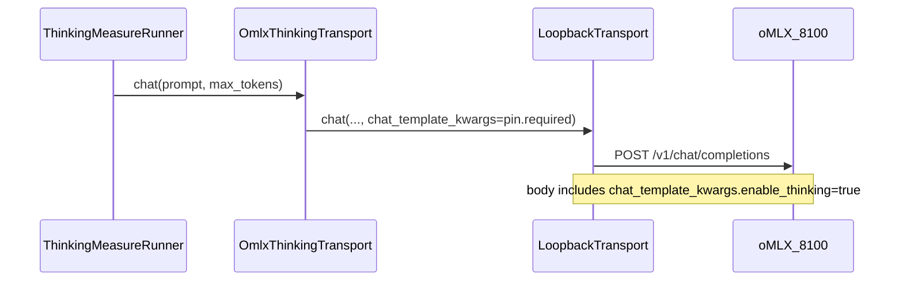

# Package 2 — Thinking Request-Pin + Gate B Profile Observe Design

**Status:** Design accepted (Jason, 2026-07-22). Fake-only / docs first.
Does **not** authorize live POSTs, new run IDs, disk upgrades, OptiQ retarget,
plugin rebuild, D3 external-bench, or D4 decode accounting.

**Depends on:** Package 2 D2 live PASS `omlx-thinking-measure-20260722-001`
(sealed on pin revision `1`). This design creates pin revision `2` so sealed
r1 evidence stays untouched.

**Context:** Qwen OptiQ chat templates default thinking off unless something
turns it on. Gemma/Ornith did not hit this because their defaults already kept
thinking on. oMLX merges model/profile settings, then per-request
`chat_template_kwargs` (unless a key is forced). Harness must force thinking
on every POST so cohorts do not depend on UI profile state.

## Goal

Fail-closed thinking for the Package 2 oMLX thinking-measure lane by pinning
`enable_thinking: true` on every harness chat POST, plus a read-only Gate B
observation of `~/.omlx` model settings for diagnostics — without failing live
readiness on a UI file.

## Locked decisions

1. **Scope now (approach 2):** Request-pin + Gate B `~/.omlx` observe.
2. **Deferred (approach 3 → follow-on D4):** Decode / reasoning-token accounting
   adapter (derive or qualify from streamed `reasoning_content`, or wait for
   usage `completion_tokens_details.reasoning_tokens`). Named alongside D3;
   absorbs/clarifies the D2 residual about exact visible-token decode.
3. **Pin:** New `omlx-0.5.3-thinking` **revision `2`**. Do not rewrite sealed
   revision `1` JSON or evidence.
4. **Comparison class / suites:** Unchanged (`omlx-thinking-measure-v1`,
   smoke + measure suites). Default pin path becomes r2 after Gate A lands.
5. **Required request field:** Exactly
   `chat_template_kwargs: { "enable_thinking": true }` on every thinking-lane
   chat POST (top-level OpenAI-compatible field supported by oMLX).
6. **Gate B observe:** Diagnostic only — never changes `decision`
   (`READY_FOR_LIVE_AUTHORIZATION` still depends on pin/version/port as today).
7. **Live:** Separately gated. No new run ID from this design.

## Pin contract (revision 2)

| Field | Value |
|---|---|
| File | `config/omlx-pins/omlx-0.5.3-thinking-r2.json` |
| `pin_id` | `omlx-0.5.3-thinking` |
| `revision` | `2` |
| `version` | `0.5.3` |
| Model / base URL / start command | Same as revision `1` |
| `required_chat_template_kwargs` | Exactly `{"enable_thinking": true}` |

Loader rules:

- Fail-closed if `required_chat_template_kwargs` is missing, not an object, or
  not exactly `{ "enable_thinking": true }` (boolean true only).
- Constants in `omlx_thinking_pin.py` bump `PIN_REVISION` to `"2"` and
  `default_pin_path()` to the r2 file.
- Revision `1` file remains in-tree as historical / rollback reference; sealed
  evidence continues to cite r1.

## Transport plumbing

- `OmlxThinkingTransport.chat` always passes pin
  `required_chat_template_kwargs` into the loopback client.
- Extend `LoopbackTransport.chat` with optional
  `chat_template_kwargs: Mapping[str, object] | None = None`. When non-empty,
  include it in the JSON body; when `None`/empty, omit (Stage 2 OptiQ paths
  unchanged).
- Do not send unrelated `extra_body` keys in this slice unless already
  allowlisted and required by the pin (r2 requires only the kwargs object).

## Gate B observe contract

Read-only probe of `~/.omlx/model_settings.json` for the pinned `model_id`
only. Report under `omlx_profile_observe`:

| Field | Meaning |
|---|---|
| `status` | `ok` / `file_missing` / `model_missing` / `unreadable` |
| `enable_thinking` | boolean if present, else `null` |
| `active_profile_name` | string if present, else `null` |
| `profile_enable_thinking` | if `active_profile_name` set, optional boolean from `model_profiles.json` for that profile under the same model key; else `null` |

Rules:

- Observe-only: values are recorded in the Gate B JSON report; they **must not**
  change `decision` or exit code semantics.
- Never open, parse for auth, or echo `~/.omlx/settings.json` (API keys / secrets).
- Missing files or missing model keys are soft observe statuses, not readiness
  failures.
- Fake-only tests inject temp JSON paths; live default uses `Path.home() / ".omlx"`.

## Follow-on ledger

| ID | Scope | Status |
|---|---|---|
| **D2** | Expanded harness measure suite | Live PASSED (`omlx-thinking-measure-20260722-001`) |
| **D3** | Optional oMLX external-bench lane | Deferred |
| **D4** | Decode / reasoning-token accounting adapter | Deferred (serious follow-on; this design parks it) |

D2 residual (no stream `reasoning_tokens` →
`SUPPRESSED_AMBIGUOUS_TOKEN_ACCOUNTING`) remains closed as PASS evidence; **D4**
is the measurement-depth next step, not a reopen of D2.

## Non-goals

- Live re-measure or new run ID  
- D3 external-bench wiring  
- D4 decode adapter / deriving tokens from `reasoning_content`  
- Editing `~/.omlx` profiles or forcing UI defaults  
- Mixing Stage 2 OptiQ sealed `005`/`006` evidence  
- Plugin `0.3.0` rebuild  

## Deliverables (Gate A)

| Artifact | Path |
|---|---|
| This design | `docs/superpowers/specs/2026-07-22-package-2-thinking-request-pin-design.md` |
| Implementation plan | `docs/superpowers/plans/2026-07-22-package-2-thinking-request-pin-gate-a.md` (after plan writing) |
| Pin r2 | `config/omlx-pins/omlx-0.5.3-thinking-r2.json` |
| Code | `omlx_thinking_pin.py`, `omlx_thinking_transport.py`, `transport.py`, `omlx_thinking_gate_b_check.py` |
| Tests | Extend pin / transport / Gate B fake-only tests |
| Docs | Gate B / D2 follow-on tables + architecture one-liner naming D4 |

## Success criteria

- Pin r2 loads fail-closed via the approved loader (default path is r2). The r1
  JSON remains on disk as historical evidence; the revision-`2` loader must
  reject it if pointed at that path.
- Fake transport assertions prove every thinking POST body includes
  `chat_template_kwargs.enable_thinking === true`.
- Gate B report includes `omlx_profile_observe` without affecting READY decision.
- Docs name D3 + D4 as deferred follow-ons.
- No live authority created.

## Related

- D2 status: `docs/package-2-omlx-thinking-d2.md`
- Gate D follow-ons: `docs/package-2-omlx-thinking-gate-d.md`
- Package 2 measure design: `docs/superpowers/specs/2026-07-22-package-2-omlx-thinking-measure-design.md`
- Sealed D2 evidence: `docs/superpowers/verification/2026-07-22-package-2-d2-omlx-thinking-measure-20260722-001.md`
